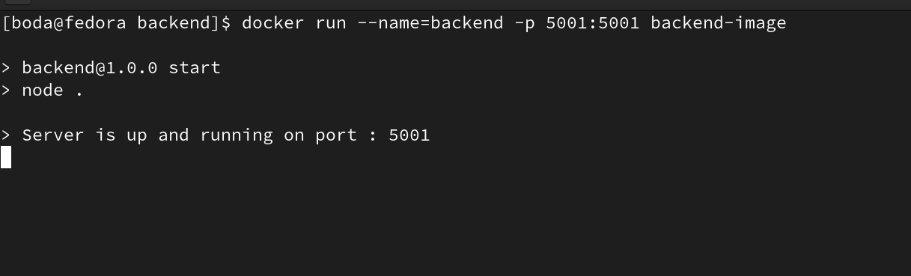
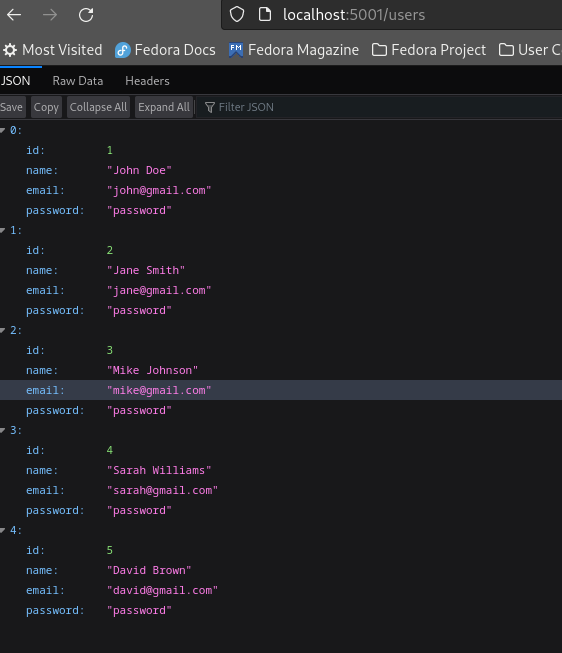

# DeploymentProject
- This repository is used for deploying the application.


## Description
- Main Branch: Describes the repository.
- Frontend Branch: Used for developing the frontend.
- Backend Branch: Used for developing the backend.


## Initial Testing Steps

1. Create Dockerfiles: After developing the frontend and backend applications, create a Dockerfile for each.

2. Locate Dockerfiles:

    - The Dockerfile for the backend is located in the backend branch.
    - The Dockerfile for the frontend is located in the frontend branch.
3. Build Docker Images:

   - Build an Image for the Backend Dockerfile:
     ```s
     docker build backend-image . 
     ```

   - Build an Image for the Frontend Dockerfile:
       ```s
       docker build frontend-image .
       ```
   **Hint** The `-t` flag is used to tag the Docker image with a name (backend-image or frontend-image).

   **Hint** The `.` refers to the current directory, where Docker looks for the Dockerfile. Make sure you are in the correct directory where each Dockerfile is located when running the respective command.


### Backend Application 

**To make the application accessible externally, you need to set up port mapping. Use the following command to expose the application externall**

```s    
docker run --name=backend -p 5001:5001 backend-image
```

<p style="text-align: center;">
  
</p>

**When you access it in the browse**


<p style="text-align: center;">

</p>
