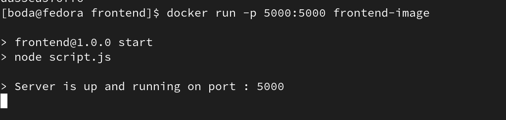
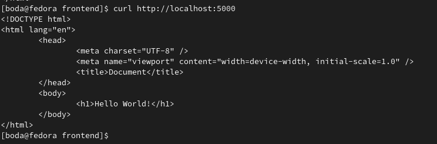
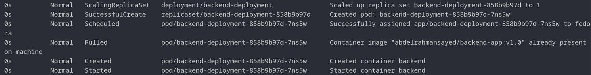
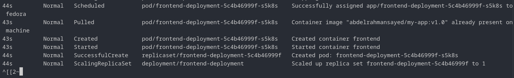
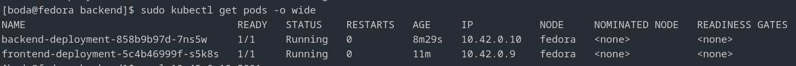
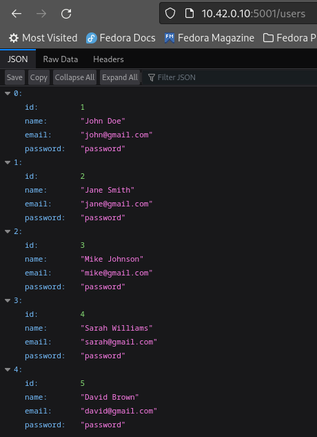
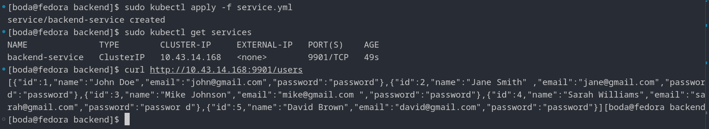
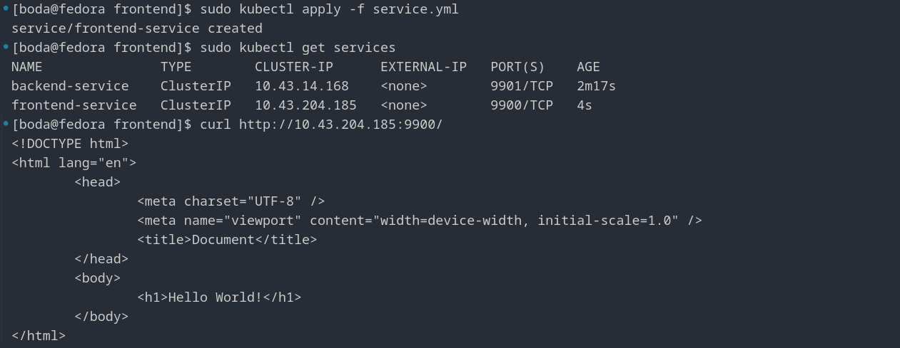
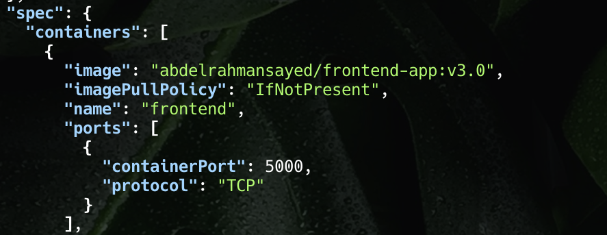
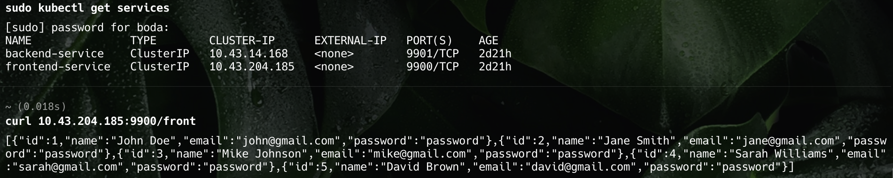

# DeploymentProject
- This repository is used for deploying the application.

## Main Goal

The main purpose is to ensure that the frontend can successfully connect to the backend. First, we need to verify that both the frontend and backend are functioning correctly and can interact with each other as expected when running in their respective containers.

## Description
- Main Branch: Describes the repository.
- Frontend Branch: Used for developing the frontend.
- Backend Branch: Used for developing the backend.


## Testing the Images I Built

1. Create Dockerfiles: After developing the frontend and backend applications, create a Dockerfile for each.

2. Locate Dockerfiles:

    - The Dockerfile for the backend is located in the backend branch.
    - The Dockerfile for the frontend is located in the frontend branch.
3. Build Docker Images:

   - Build an Image for the Backend Dockerfile:
     ```s
     docker build backend-image . 
     ```

   - Build an Image for the Frontend Dockerfile:
       ```s
       docker build frontend-image .
       ```
   **Hint** The `-t` flag is used to tag the Docker image with a name (backend-image or frontend-image).

   **Hint** The `.` refers to the current directory, where Docker looks for the Dockerfile. Make sure you are in the correct directory where each Dockerfile is located when running the respective command.


### Backend Application 

**To make the application accessible externally, you need to set up port mapping. Use the following command to expose the application externall**

```s    
docker run --name=backend -p 5001:5001 backend-image
```

<p align = "center">
  
</p>

**When you access it in the browse**


  <p align = "center">
  
  </p>


### Frontend Application 

**To make the application accessible externally, you need to set up port mapping. Use the following command to expose the application externall**

```s    
docker run -p 5000:5000 frontend-image
```

<p align = "center">
  
</p>

**When you access it in the browse**


<p align = "center">

</p>


the main pupose is frontend reach to backend that everything we make it untill now is ensure that frontend is worked and ensure that backend is worked when acess it.

### Pushing Images to Docker Hub

**Push these images to Docker Hub**

- Frontend
    
    1. Tag the Image
   
    ```s
    docker tag frontend-image abdelrahmansayed/my-app:v1.0
    ```

    2. Push the Image
   
    ```s
    docker push abdelrahmansayed/my-app:v1.0
    ```

- Backend   
    1. Tag the Image
   
    ```s
    docker tag backend-image abdelrahmansayed/backend-app:v1.0
    ```

    2. Push the Image
   
    ```s
    docker push abdelrahmansayed/backend-app:v1.0
    ```

## Deployment with Kubernetes

Go to the kube branch to view the YAML files that I used.

### First, Let’s Remember Why Kubernetes

- Automated Deployment and Scaling: Kubernetes automates the deployment, scaling, and management of containerized applications, ensuring high availability and efficient resource use.

- Self-Healing: It automatically replaces failed containers, restarts them, and reschedules them to maintain the desired state of your applications.

- Service Discovery and Load Balancing: Kubernetes provides built-in service discovery and load balancing to distribute traffic across containers, improving application reliability and performance.

- Resource Management: Kubernetes efficiently manages resources such as CPU and memory, optimizing utilization and cost.

- Multi-Cloud and Hybrid Deployments: Kubernetes supports running applications across multiple clouds and on-premises environments, providing flexibility and avoiding vendor lock-in.
- 
### backend deployment

`Create Backend Deployment`: Ensure that deployment.yml is in the same directory as where you run the command or specify the path to the file.
    ```s
    sudo kubectl apply -f deployment.yml
    ```
    <p align = "center">
    
    </p>

### frontend app
`Create Frontend Deployment`: Ensure that deployment.yml is in the same directory as where you run the command or specify the path to the file.
  ```s
sudo kubectl apply -f deployment.yml
```

  <p align = "center">

</p>

### View the Pods and Show Their IPs

 <p align = "center">
      
      </p>

### Accessing the Application Using the Pod IP and Internal Port
 
 Check the internal port that the application is using by inspecting the Pod's container specification:

 ```s
 kubectl describe pod <pod-name>
 ```

 <p align = "center">
      
      </p>

Until now, there have been no issues, and you can communicate between the frontend and backend applications without any problems.

However, let's imagine that a Pod fails and is replaced by a new one, which has a different IP address. If you rely on the IP address to connect between the frontend and backend, you will need to update the IP addresses in your configuration whenever a Pod is replaced.

This approach can lead to problems with managing and maintaining IP addresses, especially if Pods frequently restart or are rescheduled.

So, how can we solve this problem? Using Services

### Backend Service

`Create Backend Service`: Expose the application to users.

 <p align = "center">
      
      </p>

### Backend Service

`Create Frontend Service`: Expose the application to users.

 <p align = "center">
      
      </p>

### We will now access the backend from the frontend.

**Issue**

For the first frontend image, I set the endpoint to connect to the backend using `http://localhost:5001/users`, but this is incorrect. I want to change it to use the IP of the backend service, not the pod created by the deployment. However, the IP address of the service is unknown at build time; it is only assigned after the service is created. How can I specify this IP in the application before building the image?

**Solution**

This version clarifies that the challenge is specifying a service IP address in the frontend application before the service is created and the IP address is known.

To solve this problem, instead of using an IP address, you should use the Kubernetes DNS name for the backend service. This way, you don’t need to guess or hard-code the IP.

For example, if your backend service is named `backend-service` and you know the `port` number to use, specify the endpoint in your frontend code like this:
```js
"http://backend-service:9901/users"
```

Kubernetes will automatically resolve the service name to the correct IP address internally.


**Here are the steps to access the backend from the frontend:**

1. Update the frontend code, specifically script.js.

2. Rebuild your frontend application into a new image.

3. Update the frontend deployment to use the new image.

4. Reapply the frontend deployment using the following command:

  ```s
  sudo kubectl apply -f path/deployment.yaml
  ```
  To verify if the deployment has been updated, use this command:
  
  ```s
  sudo kubectl get deployment frontend-deployment -o json | jq .spec
  ```
  
  <p align="center">  </p>


**Let's try this after the update:**

<p align="center">  </p>
